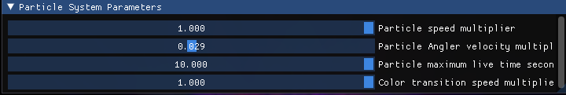
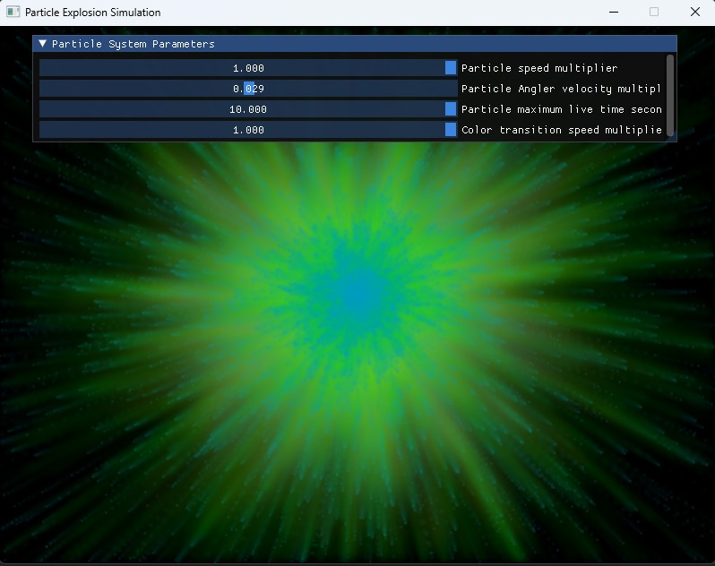

# ImGui SDL Particle Simulation

A basic, pixel-wise particle simulation designed for practicing with ImGui. <br />

## How it Looks


## Screenshots
#### ImGui simulation parameters

#### Simulation with visible ImGui UI


## Build Instructions
### Dependencies

- CMake
- SDL2

#### `CMake` Installation.
This is an example script for Ubuntu
```shell script
$ sudo apt install cmake

$ mkdir build && cd build
$ cmake --config Release --target ParticleSimulation ..
$ cmake --build -- -j $(nproc)
```

#### `vcpkg` Installation.
```shell script
$ git clone https://github.com/Microsoft/vcpkg.git
$ ./vcpkg/bootstrap-vcpkg.sh -disableMetrics
```

Install dependencies through `vcpkg`.<br />
```shell script
$ ./vcpkg/vcpkg install sdl2
```